# Project Summary

OutageIntel is a real-time IT outage intelligence platform built for enterprise IT and operations teams. It continuously monitors major vendor status feeds, normalizes incidents into a unified data model, and surfaces live vendor health plus outage history in a single dashboard.

The platform supports severity/status/time filtering, vendor-level visibility, and subscription-based alerting for high-impact incidents. A secured polling endpoint enables automated ingestion and near real-time updates, helping teams detect and respond to external service disruptions faster.

## Tech Stack

- Frontend: Next.js 14, React 18, TypeScript, Tailwind CSS, Radix UI, React Query
- Backend: Next.js Route Handlers (API endpoints)
- Database & ORM: PostgreSQL, Prisma
- Polling & Data Ingestion: rss-parser, native fetch, date-fns
- Notifications: React Email templates, Resend
- Tooling: npm scripts, ESLint, PostCSS, Autoprefixer

## Summary-Aligned Architecture Tree

```mermaid
flowchart TD
	A[OutageIntel Platform]

	A --> B[Platform Core]
	B --> B1[src/app/page.tsx]
	B --> B2[src/app/layout.tsx]
	B --> B3[src/app/providers.tsx]
	B --> B4[src/app/globals.css]

	A --> C[Backend APIs]
	C --> C1[src/app/api/vendors/route.ts]
	C --> C2[src/app/api/outages/route.ts]
	C --> C3[src/app/api/subscribe/route.ts]
	C --> C4[src/app/api/cron/poll/route.ts]

	A --> D[Data Layer]
	D --> D1[prisma/schema.prisma]
	D --> D2[prisma/seed.ts]
	D --> D3[src/lib/prisma.ts]

	A --> E[Polling & Ingestion]
	E --> E1[src/lib/pollers/generic-rss.ts]
	E --> E2[src/lib/pollers/index.ts]

	A --> F[Notifications]
	F --> F1[src/emails/OutageAlert.tsx]

	A --> G[Frontend Components]
	G --> G1[src/components/DashboardHeader.tsx]
	G --> G2[src/components/SummaryBar.tsx]
	G --> G3[src/components/VendorGrid.tsx]
	G --> G4[src/components/OutageFeed.tsx]
	G --> G5[src/components/SeverityFilter.tsx]
	G --> G6[src/components/SubscribeModal.tsx]
	G --> G7[src/components/Logo.tsx]

	A --> H[Types & Utilities]
	H --> H1[src/types/index.ts]
	H --> H2[src/lib/utils.ts]

	A --> I[Brand Assets]
	I --> I1[public/logo.svg]
	I --> I2[public/logo-dark.svg]
	I --> I3[public/favicon.svg]
```

