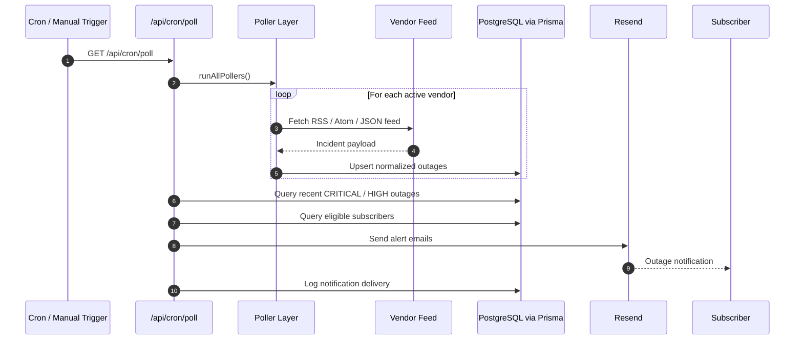
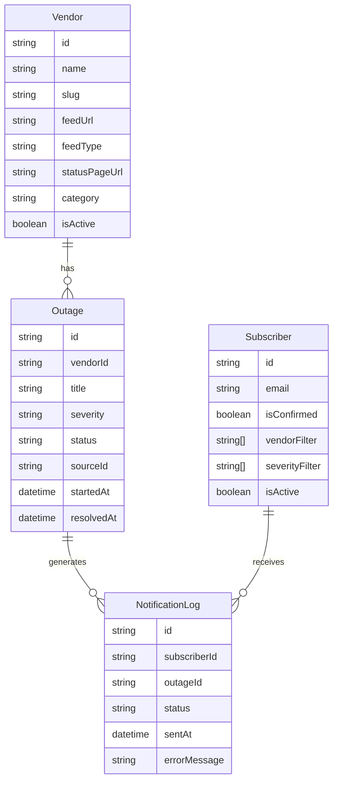

# OutageIntel

> Real-time IT outage intelligence for enterprise teams.

**outageintel.org** monitors AWS, Azure, Microsoft 365, Google Cloud, CrowdStrike,
Salesforce, ServiceNow, Okta, Cloudflare, GitHub, Zoom, Slack, Broadcom and more —
alerting your team the moment a vendor goes down.

## Project Summary

OutageIntel is a real-time enterprise outage intelligence platform built to give IT and operations teams a single live view of vendor incidents. It polls public status feeds, normalizes outage events into PostgreSQL with Prisma, exposes API endpoints for status and history, and presents the data in a modern Next.js dashboard with filtering, alert subscriptions, and email notifications.

- Frontend: Next.js 14, React 18, TypeScript, Tailwind CSS
- Backend: Next.js Route Handlers with polling and subscription APIs
- Data layer: Prisma ORM with PostgreSQL
- Notifications: React Email templates with Resend integration
- Coverage: 16 monitored enterprise vendors with live status and 24-hour outage history

## Features
- Live outage feed — auto-refreshes every 60 seconds
- 16+ vendor status pages monitored continuously
- Email alerts for Critical / Major outages within 90 seconds
- Severity filters: Critical, Major, Minor, Informational
- 24-hour outage history with resolution tracking
- Subscribe with vendor & severity preferences
- Microsoft Teams & Slack webhook support (Pro)

## Stack
Next.js 14 · TypeScript · Tailwind CSS · Prisma · PostgreSQL · Resend · Vercel

## Getting Started

## Architecture

### High-level flow
1. Vendor metadata is seeded into the database with each vendor's public feed URL and feed type.
2. The polling layer fetches active vendor feeds and parses RSS, Atom, or JSON responses.
3. Pollers infer severity and outage state, deduplicate by vendor and source ID, and persist incidents.
4. API routes aggregate vendor and outage data for the frontend.
5. The Next.js dashboard consumes those APIs and refreshes the UI periodically.
6. The cron endpoint optionally sends subscriber email alerts for new CRITICAL or HIGH incidents.

### Logical architecture

```mermaid
flowchart TD
  A[Vendor Status Feeds<br/>RSS / Atom / JSON] --> B[Poller Orchestration Layer]
  B --> C[Prisma ORM]
  C --> D[(PostgreSQL)]
  D --> E[/api/vendors]
  D --> F[/api/outages]
  D --> G[/api/subscribe]
  D --> H[/api/cron/poll]
  E --> I[Next.js Dashboard UI]
  F --> I
  G --> I
  H --> B
  H --> J[Resend Email Delivery]
  J --> K[Subscribers]
```

### Polling and alert lifecycle



### Data model overview



### Application layers
- Frontend: Next.js App Router pages and reusable React components.
- API layer: Route handlers under `src/app/api` for polling, vendors, outages, and subscriptions.
- Data layer: Prisma client with PostgreSQL models for vendors, outages, subscribers, and notification logs.
- Polling layer: Generic feed polling utilities plus orchestration across all active vendors.
- Notification layer: Resend-backed email delivery with notification deduplication.

## Repository structure

```text
prisma/
  schema.prisma        # Database schema
  seed.ts              # Vendor seed data
src/
  app/
    api/
      cron/poll/       # Polling + notification trigger endpoint
      outages/         # Outage query API
      subscribe/       # Email subscription API
      vendors/         # Vendor status summary API
    layout.tsx         # Root app layout
    page.tsx           # Main dashboard page
    providers.tsx      # React Query providers
  components/          # Dashboard UI components
  emails/              # React Email templates
  lib/
    pollers/           # Feed polling and orchestration
    prisma.ts          # Prisma singleton client
    utils.ts           # Shared helpers
  types/               # Shared TypeScript types
```

## Toolset and technology stack

### Frontend
- Next.js 14.2.5
- React 18
- TypeScript
- Tailwind CSS
- shadcn/ui-style component primitives built on Radix UI
- TanStack React Query for client-side data fetching and refresh
- Lucide React icons

### Backend and APIs
- Next.js Route Handlers
- Zod for payload validation patterns
- date-fns for date window calculations
- rss-parser for feed ingestion
- node-cron-compatible polling design through a secured cron endpoint

### Database and ORM
- PostgreSQL
- Prisma ORM
- Prisma Client
- Seed script for initial vendor population

### Notifications
- Resend for email delivery
- React Email components for templated alerts and confirmations

### Developer tooling
- npm scripts for app lifecycle and database operations
- ESLint
- TSX for running TypeScript seed scripts
- PostCSS + Autoprefixer

## Database design

OutageIntel uses PostgreSQL with Prisma as the schema and query layer.

### Main tables
- `vendors`: Source-of-truth registry of monitored vendors, feed URLs, categories, and status-page links.
- `outages`: Normalized incident records pulled from vendor feeds.
- `subscribers`: Email subscribers with optional vendor and severity filters.
- `notification_log`: Tracks alert delivery and prevents duplicate notifications.

### Key relationships
- One vendor has many outages.
- One outage can produce many notification log records.
- One subscriber can receive many notifications.

### Main enums
- `FeedType`: `RSS`, `JSON`, `ATOM`
- `VendorCategory`: cloud, security, productivity, devops, communication, CRM, ITSM, networking, monitoring, other
- `Severity`: `CRITICAL`, `HIGH`, `MEDIUM`, `LOW`, `UNKNOWN`
- `OutageStatus`: `INVESTIGATING`, `IDENTIFIED`, `MONITORING`, `RESOLVED`
- `NotificationStatus`: `SENT`, `FAILED`, `SKIPPED`

### Data quality rules
- Outages are deduplicated with a unique key on `(vendorId, sourceId)`.
- Vendor status is computed from recent active outages.
- Notification delivery is deduplicated per `(subscriberId, outageId)`.

## Supported vendor coverage in v1.0

The seed currently includes 16 vendors across multiple categories:
- Cloud: AWS, Azure, GCP
- Productivity and communication: Microsoft 365, Zoom, Slack, Twilio
- Security: CrowdStrike, Okta, Broadcom
- Networking: Cloudflare
- DevOps: GitHub, Atlassian
- CRM / ITSM / monitoring: Salesforce, ServiceNow, Datadog

## API surface

### `GET /api/vendors`
Returns vendor cards plus a computed summary of operational, degraded, outage, and unknown status counts.

### `GET /api/outages`
Returns outage records for a given time window with optional vendor, severity, and status filters.

### `POST /api/subscribe`
Stores email subscriptions and preference filters.

### `GET /api/cron/poll`
Secured endpoint that polls all active vendors, stores new incidents, and sends high-severity notifications.

## Frontend experience

The main dashboard includes:
- Header with refresh and subscribe actions
- Summary bar with live counts
- Vendor status grid with click-to-filter behavior
- Outage feed with severity, status, and time-window filters
- Subscription modal for notification preferences

## Environment configuration

Copy `.env.example` into `.env` and update the values for your environment.

### Required
- `DATABASE_URL`: PostgreSQL connection string

### Optional but recommended
- `CRON_SECRET`: protects the polling endpoint
- `NEXT_PUBLIC_APP_URL`: canonical app URL
- `RESEND_API_KEY`: enables email notifications
- `EMAIL_FROM`: sender identity for alert emails

## Local setup

### 1. Install dependencies
```bash
npm install
```

### 2. Configure environment
```bash
cp .env.example .env
```

### 3. Push the Prisma schema
```bash
npm run db:push
```

### 4. Seed vendors
```bash
npm run db:seed
```

### 5. Start the app
```bash
npm run dev -- -p 4301
```

### 6. Build for production validation
```bash
npm run build
```

## Database and developer commands

```bash
npm run dev
npm run build
npm run start
npm run lint
npm run db:generate
npm run db:push
npm run db:migrate
npm run db:seed
npm run db:studio
npm run db:reset
```

## Operational notes

- The dashboard can render all vendors immediately after seeding, but outages only appear after polling has been run.
- In local development, polling is not automatic unless an external scheduler or manual request triggers `/api/cron/poll`.
- Email alerts are skipped safely if `RESEND_API_KEY` is not configured.
- The cron endpoint supports Bearer-token protection through `CRON_SECRET`.

## Current v1.0 characteristics

### Strengths
- Full-stack implementation in one Next.js codebase
- Normalized data model for heterogeneous vendor feeds
- Extensible vendor registry and poller pipeline
- Secure polling endpoint and notification deduplication
- Production-friendly path to scheduled polling and email alerts

### Current limitations
- Feed parsing quality depends on public vendor feed consistency
- Polling is currently trigger-based, not a continuously running internal worker
- Severity inference is heuristic and based on feed text patterns
- Real-time status depends on successful polling cadence and feed availability

## Suggested next milestones
- Add historical trend charts and outage analytics
- Add admin tools for vendor/feed health monitoring
- Add subscription confirmation and unsubscribe routes to the public UX flow
- Add automated tests for pollers, API routes, and status computation
- Add deployment documentation for Vercel or Docker

## License / ownership

This repository currently reflects the OutageIntel v1.0 application state and repository structure prepared for active development on the `Dev` branch.
